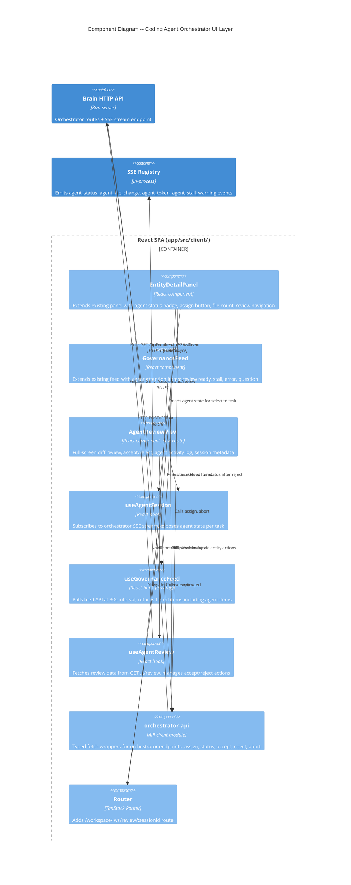

# Coding Agent Orchestrator -- UI Architecture

## Overview

Three client-side surfaces consume the existing orchestrator API and SSE streams. Each surface has a distinct cognitive purpose: delegation trigger (task popup), attention routing (feed), and deep review (review view). No new backend endpoints are needed.

---

## C4 Component Diagram (L3) -- Client-Side Architecture



---

## Component Boundaries

### Extended Components

| Component | File | Changes |
|-----------|------|---------|
| `EntityDetailPanel` | `components/graph/EntityDetailPanel.tsx` | Add agent status section (conditional on task kind + active agent session). Show assign button, status badge, file count, elapsed time, review link. |
| `GovernanceFeed` | `components/feed/GovernanceFeed.tsx` | No code changes needed. Feed items are built server-side in `feed-route.ts`. Agent items arrive as `GovernanceFeedItem` with `entityKind: "task"`. |
| `FeedItem` | `components/feed/FeedItem.tsx` | Extend `handleAction` to support `"review"` action that navigates to review view instead of calling entity action API. |
| `Router` | `router.tsx` | Add review route under authenticated layout. |

### New Components

| Component | File | Responsibility |
|-----------|------|---------------|
| `AgentReviewView` | `routes/review-page.tsx` | Full-screen review page. Renders diff, agent summary, activity log, session metadata, accept/reject buttons. |
| `AgentStatusSection` | `components/graph/AgentStatusSection.tsx` | Sub-component rendered inside EntityDetailPanel for tasks with active agent sessions. Encapsulates agent-specific UI to keep the panel lean. |
| `DiffViewer` | `components/review/DiffViewer.tsx` | Renders unified diff with file-level expand/collapse. Parses raw diff string into per-file sections. |
| `AgentActivityLog` | `components/review/AgentActivityLog.tsx` | Renders agent activity timeline (file changes, tool calls, key events). |

### New Hooks

| Hook | File | Responsibility |
|------|------|---------------|
| `useAgentSession` | `hooks/use-agent-session.ts` | Manages SSE subscription to orchestrator stream. Exposes agent state: status, file count, elapsed time, stall warning. Keyed by agent session ID. |
| `useAgentReview` | `hooks/use-agent-review.ts` | Fetches review data (diff, summary, session metadata). Provides `accept()` and `reject(feedback)` mutation functions. |

### New API Client Module

| Module | File | Responsibility |
|--------|------|---------------|
| `orchestrator-api` | `graph/orchestrator-api.ts` | Typed fetch wrappers for all orchestrator endpoints. Follows existing pattern in `graph/actions.ts`. |

---

## State Management

### Agent Session State (useAgentSession)

The hook manages real-time agent state via SSE. It connects to the orchestrator stream endpoint when an active session exists.

**State shape:**

```
AgentSessionState = {
  status: "spawning" | "active" | "idle" | "completed" | "aborted" | "error"
  filesChanged: number
  startedAt: string
  lastEventAt?: string
  stallWarning?: { lastEventAt: string; stallDurationSeconds: number }
  error?: string
}
```

**SSE connection lifecycle:**

1. Component mounts with `agentSessionId` and `streamId` (from initial assign response or session status poll)
2. Hook opens `EventSource` to `GET /api/orchestrator/:ws/sessions/:sessionId/stream`
3. Incoming events update state: `agent_status` -> status, `agent_file_change` -> filesChanged++, `agent_stall_warning` -> stallWarning
4. On `completed` or `aborted` status, close `EventSource`
5. On unmount, close `EventSource`

**Bootstrap (no SSE yet):** When user opens a task popup for a task with an existing agent session but no active SSE connection (e.g. page reload), the hook first fetches session status via `GET .../sessions/:sessionId` to get current state, then opens SSE if status is active.

**Error handling and reconnection:** The native `EventSource` API retries automatically on connection loss (with server-sent `retry:` interval). The hook handles the `onerror` callback by setting a `connectionError` flag in state, which surfaces a "Connection lost, retrying..." indicator in the UI. On terminal status events (`completed`, `aborted`, `error`), the hook closes the `EventSource` and does not retry. If the SSE endpoint returns 404 (session expired/cleaned up), the hook falls back to a one-time status poll and closes.

### Feed State (useGovernanceFeed -- existing)

No client-side changes needed to the hook. Agent-related feed items are built server-side in `feed-route.ts` by querying `agent_session` records with `orchestrator_status IN ["idle", "error"]` and matching them to their task records. The existing 30-second poll picks these up.

**Server-side feed additions needed (not UI architecture scope, but documented for traceability):**

The feed route needs a new query in `feed-queries.ts` to produce agent-related `GovernanceFeedItem` entries:
- `idle` sessions -> tier `review`, action `["review", "abort"]`
- `error` sessions -> tier `blocking`, action `["discuss"]`
- Stalled sessions (auto-aborted) -> tier `blocking`, action `["discuss"]`
- Agent questions (observations with `source_agent = "opencode"`) -> tier `review`, action `["discuss"]`

### Review State (useAgentReview)

Simple fetch-on-mount with mutation functions. No persistent client state.

**State shape:**

```
AgentReviewState = {
  isLoading: boolean
  error?: string
  data?: {
    taskTitle: string
    summary?: string
    diff: {
      files: Array<{ path: string; status: string; additions: number; deletions: number }>
      rawDiff: string
      stats: { filesChanged: number; insertions: number; deletions: number }
    }
    session: {
      startedAt: string
      lastEventAt?: string
      decisionsCount: number
      questionsCount: number
      observationsCount: number
    }
  }
  acceptState: "idle" | "pending" | "success" | "error"
  rejectState: "idle" | "pending" | "resumed" | "error"
}
```

---

## Data Flow

### Surface 1: EntityDetailPanel -- Agent Assignment

```
User clicks task node
    -> GraphPage renders EntityDetailPanel with entityId
    -> EntityDetailPanel fetches entity detail (existing)
    -> If entity.kind === "task" AND status in ["ready", "todo"]:
        -> Render AgentStatusSection with "Assign to Agent" button
    -> If entity has active agent_session (check via session status endpoint):
        -> useAgentSession subscribes to SSE
        -> AgentStatusSection renders live status badge, file count, elapsed time
        -> If status === "idle": render "Review" button -> navigate to review route
```

**How EntityDetailPanel discovers active sessions:**

The entity detail API already returns `entity.data` which includes task fields. The panel needs the agent session ID to connect SSE. Two options:

1. **Extend entity detail response** -- add optional `agentSession` field when the entity is a task with an active session. This avoids a second HTTP call.
2. **Separate status call** -- call `GET /api/orchestrator/:ws/sessions?taskId=:taskId` to check for active sessions.

**Decision: Option 1** -- extend the entity detail response. The backend already joins to related tables; adding one more field is cheaper than an extra round-trip. The entity detail handler checks for active `agent_session` records where `task_id = $taskRecord AND orchestrator_status IN ["spawning", "active", "idle"]`. Trade-off: this couples the entity detail endpoint to orchestrator concerns, but the coupling is minimal (one conditional query for task entities only, returns undefined for all other entity types). Option 2 would keep the endpoints decoupled but adds latency and complexity to every task popup render.

### Surface 2: GovernanceFeed -- Agent Attention Items

```
useGovernanceFeed polls every 30s
    -> Server feed-route builds GovernanceFeedItem entries for agent events
    -> Items use entityKind: "task", entityId: "task:<taskId>"
    -> FeedItem renders with agent-specific reason text
    -> "Review" action button navigates to review route
    -> "Abort" action calls POST .../abort
    -> "Discuss" action navigates to chat (existing pattern)
```

### Surface 3: AgentReviewView -- Diff Review

```
User navigates to /workspace/:ws/review/:sessionId
    (via task popup "Review" button or feed "Review" action)
    -> AgentReviewView mounts
    -> useAgentReview fetches GET .../sessions/:sessionId/review
    -> Renders: task title, agent summary, diff viewer, activity log, session metadata
    -> Accept button: POST .../accept -> success state -> navigate back to graph
    -> Reject button: show feedback textarea -> POST .../reject -> transition to monitoring state
        -> useAgentSession re-subscribes to SSE for live updates
        -> When agent reaches "idle" again, re-fetch review data
```

---

## SSE Event Routing (Client-Side)

| SSE Event | useAgentSession | EntityDetailPanel | AgentReviewView |
|-----------|----------------|-------------------|-----------------|
| `agent_status` | Updates `status` | Re-renders badge via hook | Re-renders status, enables/disables buttons |
| `agent_file_change` | Increments `filesChanged` | Shows updated count | Updates file list (after reject) |
| `agent_token` | Ignored (not needed for status) | -- | Optionally appended to activity log |
| `agent_stall_warning` | Sets `stallWarning` | Shows warning icon | Shows stall warning banner |

The feed does NOT subscribe to SSE. It polls at 30s intervals. This is intentional: the feed shows governance items that persist in the database, not transient real-time events. A stalled agent that was auto-aborted creates a persistent feed item via the agent_session record.

---

## Routing

### New Route

| Path | Component | Parent |
|------|-----------|--------|
| `/review/$sessionId` | `AgentReviewView` (review-page.tsx) | `authLayout` (authenticated) |

The route uses `$sessionId` as a TanStack Router path parameter. The workspace ID is read from `localStorage` (same pattern as `GraphPage`).

### Navigation Flows

```
EntityDetailPanel "Review" button
    -> navigate({ to: "/review/$sessionId", params: { sessionId } })

FeedItem "Review" action
    -> navigate({ to: "/review/$sessionId", params: { sessionId } })
    (sessionId extracted from feed item metadata)

AgentReviewView "Accept" success
    -> navigate({ to: "/graph" })

AgentReviewView back/close
    -> navigate({ to: "/graph" })
```

---

## API Client (orchestrator-api.ts)

Typed wrappers following the existing `graph/actions.ts` pattern. All functions take `workspaceId` as first parameter.

| Function | Method | Endpoint | Request Body | Response |
|----------|--------|----------|-------------|----------|
| `assignAgent` | POST | `/api/orchestrator/:ws/assign` | `{ taskId }` | `{ agentSessionId, streamId, streamUrl }` |
| `getSessionStatus` | GET | `/api/orchestrator/:ws/sessions/:id` | -- | `{ orchestratorStatus, worktreeBranch, startedAt, ... }` |
| `getSessionReview` | GET | `/api/orchestrator/:ws/sessions/:id/review` | -- | `{ taskTitle, diff, session }` |
| `acceptSession` | POST | `/api/orchestrator/:ws/sessions/:id/accept` | `{ summary? }` | `{ accepted, taskStatus }` |
| `rejectSession` | POST | `/api/orchestrator/:ws/sessions/:id/reject` | `{ feedback }` | `{ rejected, continuing }` |
| `abortSession` | POST | `/api/orchestrator/:ws/sessions/:id/abort` | -- | `{ aborted, taskStatus }` |

---

## Feed Integration (Server-Side Extension Point)

The feed route (`feed-route.ts`) needs to query `agent_session` records and produce `GovernanceFeedItem` entries. This is a server-side change, not UI architecture, but is documented here for completeness since the UI depends on it.

**New feed query: `listAgentAttentionSessions`**

```
Query agent_session records WHERE workspace = $workspace
  AND orchestrator_status IN ["idle", "error"]
  JOIN task for title

Map to GovernanceFeedItem:
  - idle -> tier: "review", reason: "Agent completed work on '{task.title}' -- review ready"
    actions: [{ action: "review", label: "Review" }, { action: "abort", label: "Abort" }]
  - error -> tier: "blocking", reason: "Agent failed on '{task.title}': {error_message}"
    actions: [{ action: "discuss", label: "Discuss" }]
```

**Feed action routing:**

The `GovernanceFeed.handleAction` function needs a new branch for `action.action === "review"` that navigates to the review route instead of calling the entity action API. This follows the same pattern as the existing `"discuss"` action handler.

**GovernanceFeedItem extension:**

The `GovernanceFeedItem` type needs an optional `agentSessionId` field so the review action knows which session to navigate to. This field is populated server-side for agent-related feed items only.

---

## Entity Detail Response Extension

The `EntityDetailResponse` type gains an optional `agentSession` field. This avoids a separate HTTP call to discover active agent sessions.

```
EntityDetailResponse.entity.data.agentSession?: {
  agentSessionId: string
  orchestratorStatus: "spawning" | "active" | "idle" | "completed" | "aborted" | "error"
  streamId?: string
  startedAt: string
  filesChangedCount?: number
}
```

The entity detail handler in `entities/entity-detail-route.ts` checks for active `agent_session` records when the entity is a task. This adds one query to task entity detail requests only (no impact on other entity types).

---

## File Inventory

### New Files (6)

| File | Type | Purpose |
|------|------|---------|
| `app/src/client/routes/review-page.tsx` | Route component | Agent review view page |
| `app/src/client/components/graph/AgentStatusSection.tsx` | Component | Agent status display within EntityDetailPanel |
| `app/src/client/components/review/DiffViewer.tsx` | Component | Unified diff renderer with file expand/collapse |
| `app/src/client/components/review/AgentActivityLog.tsx` | Component | Agent activity timeline |
| `app/src/client/hooks/use-agent-session.ts` | Hook | SSE subscription for real-time agent state |
| `app/src/client/hooks/use-agent-review.ts` | Hook | Review data fetching and accept/reject mutations |

### Extended Files (5)

| File | Change |
|------|--------|
| `app/src/client/router.tsx` | Add review route |
| `app/src/client/components/graph/EntityDetailPanel.tsx` | Render AgentStatusSection for tasks |
| `app/src/client/components/feed/GovernanceFeed.tsx` | Handle "review" action navigation |
| `app/src/client/graph/actions.ts` | Add orchestrator API functions (or new `orchestrator-api.ts`) |
| `app/src/shared/contracts.ts` | Add `agentSessionId` to `GovernanceFeedItem` |

### Server-Side Extensions (not UI scope, but traced)

| File | Change |
|------|--------|
| `app/src/server/feed/feed-queries.ts` | Add `listAgentAttentionSessions` query |
| `app/src/server/feed/feed-route.ts` | Include agent items in feed response |
| `app/src/server/entities/entity-detail-route.ts` | Add optional `agentSession` to task entity detail |

---

## Quality Attribute Alignment

| Attribute | Strategy |
|-----------|----------|
| **Maintainability** | AgentStatusSection is a self-contained sub-component; EntityDetailPanel remains lean. New hooks follow existing hook patterns. |
| **Reliability** | SSE reconnection handled by EventSource native retry. Bootstrap via status poll on page load. Feed polling as fallback for SSE-missed events. |
| **Performance** | No SSE connections opened until a task with active session is selected. Feed poll reuses existing 30s interval. Review data fetched on-demand. |
| **Usability** | Three surfaces match cognitive modes: glance (popup), scan (feed), focus (review). Navigation between surfaces is one click. |
